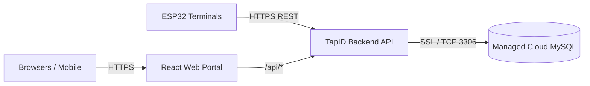

# TapID Cloud Deployment & Hosting Guide
**Production Release Guide** • **Platform Version:** 1.0.0

> [!NOTE]
> **Live Production Endpoints:**
> - **Frontend Web Portal (Vercel):** [https://tap-id-one.vercel.app](https://tap-id-one.vercel.app)
> - **Backend API Server (Render):** [https://tapid-14ao.onrender.com](https://tapid-14ao.onrender.com)
> - **Managed Cloud Database (Aiven):** `mysql-33b99771-dootisaha-2325.j.aivencloud.com:12183`

---

## Architecture of Hosted System



---

## Step 1: Provision a Free Cloud MySQL Database

TapID requires MySQL 5.7 or 8.0 with SSL enabled. You can get a free managed MySQL database without a credit card from **Aiven** or **Railway**:

### Option A: Aiven for MySQL (Recommended - Free Tier)
1. Sign up at [aiven.io](https://aiven.io).
2. Create a new service:
   - **Service Type**: MySQL (v8.0)
   - **Cloud Provider**: AWS or GCP (choose a region close to your users)
   - **Plan**: Free Plan ($0/mo)
3. Once provisioned, note down the connection parameters from the Aiven console:
   - **Host** (e.g. `mysql-xxxx.aivencloud.com`)
   - **Port** (e.g. `12345`)
   - **User** (`avnadmin`)
   - **Password**
   - **Database** (`defaultdb`)

### Option B: Railway MySQL
1. Sign up at [railway.app](https://railway.app).
2. Click **New Project** -> **Provision MySQL**.
3. Under the **Connect** tab, copy `MYSQLHOST`, `MYSQLPORT`, `MYSQLUSER`, `MYSQLPASSWORD`, `MYSQLDATABASE`.

---

## Step 2: Initialize the Cloud Database Schema & Seeds

Run the automated cloud initializer script directly from your local terminal:

```powershell
node backend/setup_cloud_db.js <HOST> <PORT> <PASSWORD> [USER] [DATABASE]
```

**Example:**
```powershell
node backend/setup_cloud_db.js mysql-xxxx.aivencloud.com 12345 mySecretPass avnadmin defaultdb
```

This single command:
1. Connects securely via TLS/SSL.
2. Creates all 11 relational tables ([`schema.sql`](file:///d:/TapID/database/schema.sql)).
3. Builds composite indexes ([`indexes.sql`](file:///d:/TapID/database/indexes.sql)).
4. Seeds default admin, faculty, student accounts, and test subjects ([`seed.sql`](file:///d:/TapID/database/seed.sql)).
5. Configures security trigger rules.

---

## Step 3: Choose Your Hosting Option

### Option 1: Unified Full-Stack Hosting on Render (Fastest & Free)

Render runs both the Node.js backend and the compiled React frontend together under a single web service and domain.

1. Push your code to GitHub: `https://github.com/dooti2325/TapID`.
2. Go to [dashboard.render.com](https://dashboard.render.com) and click **New +** -> **Blueprint**.
3. Connect your `TapID` GitHub repository. Render reads [`render.yaml`](file:///d:/TapID/render.yaml) automatically.
4. Set the following environment variables when prompted:
   - `DB_HOST`: Your cloud database host
   - `DB_PORT`: Your cloud database port (e.g., `3306` or `12345`)
   - `DB_USER`: Your cloud database username
   - `DB_PASS`: Your cloud database password
   - `DB_NAME`: Your cloud database name
   - `SERVE_STATIC`: `true`
5. Click **Apply Blueprint**.
6. Render will automatically build the frontend assets, launch the Express server, and provide your live URL (e.g., `https://tapid-app.onrender.com`).

---

### Option 2: Split Hosting (Frontend on Vercel + Backend on Render/Railway)

If you prefer deploying the frontend directly to Vercel's global Edge CDN:

#### 1. Deploy Backend to Render or Railway
- Deploy the `backend/` directory as a Node.js Web Service.
- Set environment variables (`DB_HOST`, `DB_PORT`, `DB_USER`, `DB_PASS`, `DB_NAME`, `JWT_SECRET`, `DEVICE_API_KEY`).
- Allow Vercel in CORS: `CORS_ORIGIN=https://your-tapid-frontend.vercel.app`.
- Note down your backend URL: `https://tapid-api.onrender.com`.

#### 2. Deploy Frontend to Vercel
1. Go to [vercel.com](https://vercel.com) and click **Add New...** -> **Project**.
2. Select your `TapID` repository.
3. Vercel automatically detects [`vercel.json`](file:///d:/TapID/vercel.json).
4. Add the environment variable:
   - `VITE_API_URL`: `https://tapid-api.onrender.com`
5. Click **Deploy**.
6. Your portal is live at `https://your-tapid-frontend.vercel.app`.

---

### Option 3: VPS / Cloud VM with Docker Compose (Self-Hosted)

For on-premise university servers or dedicated VPS instances (DigitalOcean, Hetzner, AWS EC2):

1. SSH into your server:
   ```bash
   ssh ubuntu@your-server-ip
   ```
2. Clone repository & configure environment:
   ```bash
   git clone https://github.com/dooti2325/TapID.git
   cd TapID
   cp .env.example .env
   nano .env  # fill in secure passwords
   ```
3. Run the containerized stack:
   ```bash
   docker compose up -d --build
   ```
4. Configure an Nginx reverse proxy with SSL via Let's Encrypt:
   ```bash
   sudo apt install -y certbot python3-certbot-nginx
   sudo certbot --nginx -d tapid.youruniversity.edu
   ```

---

## Step 4: Configure Hardware Terminals for Cloud API

Once your cloud backend is live, configure your ESP32 terminals to report to the cloud endpoint:

In [`firmware/esp32/tapid_reader/config.h`](file:///d:/TapID/firmware/esp32/tapid_reader/config.h):
```cpp
// Wi-Fi Configuration
#define WIFI_SSID       "Campus_Staff_WiFi"
#define WIFI_PASSWORD   "CampusPassword123"

// Cloud API Endpoint (Replace with your live Render or VPS domain)
#define API_BASE_URL    "https://tapid-app.onrender.com/api"
#define DEVICE_API_KEY  "tapid-esp32-device-key-2026"
#define DEVICE_ID       "ESP32_CS101_01"
```

Flash the terminal over USB or OTA. Card taps will immediately record live into your cloud database!

---

## Production Security Checklist
- [x] Passwords hashed with `bcryptjs` (salt rounds: 10).
- [x] JWT tokens signed with high-entropy secret (`JWT_SECRET`).
- [x] Rate limiting enabled on `/api/auth/login` (5 attempts per 15 min).
- [x] Strict security headers enabled (`X-Content-Type-Options: nosniff`, `X-Frame-Options: DENY`, `HSTS`).
- [x] Database connections enforce SSL/TLS with connection pooling.
- [x] Lost/stolen card revocation enforced at both trigger and API layer.
