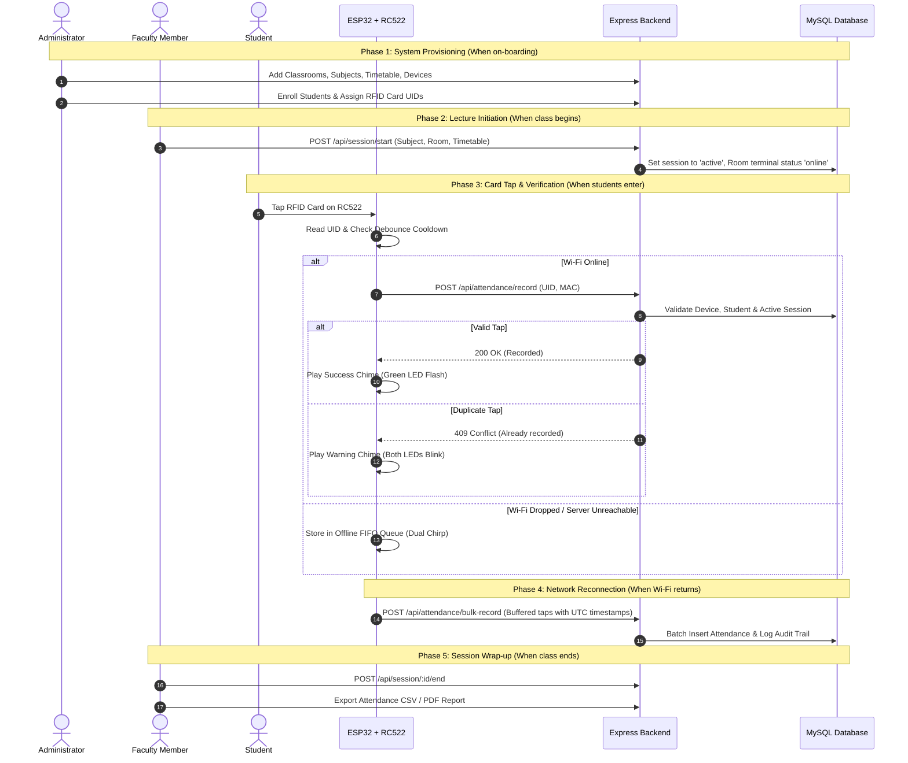

# TapID — Smart RFID Attendance Management System

Tap. Verify. Record. An end-to-end IoT and web attendance tracking platform designed for educational institutions, laboratories, and lecture halls.

TapID integrates **ESP32 microcontroller terminals** with **RC522 13.56 MHz RFID readers**, a robust **Node.js/Express REST API**, a **MySQL relational database**, and a **React 18 + Vite dashboard**.

---

## Table of Contents

- [1. What is TapID?](#1-what-is-tapid)
- [2. Where: Architecture & Directory Map](#2-where-architecture--directory-map)
- [3. When: System Lifecycle & Attendance Workflows](#3-when-system-lifecycle--attendance-workflows)
- [4. How: Step-by-Step Setup Guide](#4-how-step-by-step-setup-guide)
  - [Prerequisites](#prerequisites)
  - [Step 1: Database Setup](#step-1-database-setup)
  - [Step 2: Backend Configuration & Launch](#step-2-backend-configuration--launch)
  - [Step 3: Frontend Portal Launch](#step-3-frontend-portal-launch)
  - [Step 4: ESP32 Firmware Wiring & Flashing](#step-4-esp32-firmware-wiring--flashing)
  - [Alternative: One-Command Docker Setup](#alternative-one-command-docker-setup)
- [5. How to Run the End-to-End User Flow](#5-how-to-run-the-end-to-end-user-flow)
- [6. Verification & Automated Testing](#6-verification--automated-testing)
- [7. API Reference Matrix](#7-api-reference-matrix)
- [8. Troubleshooting & FAQ](#8-troubleshooting--faq)

---

## 1. What is TapID?

### Core Components

| Component | Technology | Primary Responsibility |
|:---|:---|:---|
| **IoT Hardware Terminal** | ESP32 + RC522 (13.56 MHz) | Scans student RFID cards, validates hardware MAC against database, plays audio chimes, blinks status LEDs, and buffers taps offline if Wi-Fi drops. |
| **Backend REST API** | Node.js 18+, Express 5, MySQL2 | Handles authentication (JWT), role-based access control, active session management, attendance recording with deduplication, audit logs, and file uploads. |
| **Relational Database** | MySQL 8.0 | Stores users, faculty profiles, student directories, RFID card-to-student mappings, classrooms, hardware terminals, timetables, and audit history. |
| **Web Application** | React 18, Vite, Tailwind CSS, Lucide | Modern dashboard for administrators (manage users, terminals, classrooms, system logs) and faculty (live attendance view, start/end sessions, export reports). |

### Key System Capabilities

- **Instant Attendance Recording**: Under 50ms server response for card tap verification.
- **Offline Resiliency**: Built-in 50-record FIFO ring buffer stores scans when network is unavailable and automatically bulk-syncs when reconnected.
- **Strict Deduplication**: Prevents accidental or fraudulent double-taps within the same session.
- **Classroom & Device Enforcement**: Terminals are registered to specific classrooms; card taps are only accepted when an active lecture session is running in that classroom.
- **Multi-Tone Feedback**: Distinct acoustic melodies for success, duplicate tap, device revoked, and offline buffering.

---

## 2. Where: Architecture & Directory Map

### Repository Map

```text
TapID/
├── backend/                  # Node.js Express REST API
│   ├── config/               # Database pool, JWT, Winston logging, config tokens
│   ├── controllers/          # Business logic for auth, attendance, devices, etc.
│   ├── middleware/           # JWT verification, RBAC, audit logging, rate limiting
│   ├── models/               # Domain abstractions
│   ├── routes/               # Express routing modules mounted under /api/*
│   ├── services/             # Analytics, report generation, email services
│   ├── tests/                # 10 Jest test suites (44 passing unit tests)
│   ├── uploads/              # Uploaded avatars and images (git-ignored)
│   ├── logs/                 # Winston daily rotate logs (git-ignored)
│   ├── server.js             # Runtime entrypoint (port 3000)
│   └── app.js                # Express app definition & static dist serving
├── frontend/                 # React 18 + Vite Web Application
│   ├── public/               # Static assets (favicon.svg, logo.png, manifest.json)
│   ├── src/
│   │   ├── components/       # Reusable UI (Sidebar, Topbar, DataTable, StatCard, Modals)
│   │   ├── context/          # AuthContext with token persistence
│   │   ├── pages/            # Admin, Faculty, Attendance, Devices, Reports, Login
│   │   ├── services/         # Axios API clients
│   │   └── styles/           # Modern glassmorphism & responsive design system
│   └── tests/                # 5 Vitest test suites (17 passing unit tests)
├── firmware/                 # ESP32 Microcontroller Firmware
│   ├── platformio.ini        # PlatformIO configuration & dependency management
│   ├── README.md             # Hardware BOM, wiring diagrams, and pinouts
│   └── esp32/
│       ├── main.ino          # Canonical PlatformIO entrypoint
│       ├── config.h          # Pin numbers, timeouts, baud rate
│       ├── secrets.h         # Wi-Fi SSID, password, API URL, and MAC address
│       ├── wifi_manager.*    # Auto-reconnect & NTP time sync
│       ├── rfid_reader.*     # RC522 SPI driver & UID parser
│       ├── offline_queue.*   # In-memory FIFO ring buffer for network dropouts
│       ├── api_client.*      # HTTP client for single & bulk REST calls
│       ├── buzzer.* / led.*  # Multi-tone acoustic & visual feedback
│       └── tapid_reader/     # Self-contained Arduino IDE sketch folder
├── database/                 # Database Definitions & Seed Data
│   ├── schema.sql            # Table definitions, foreign keys, constraints
│   ├── indexes.sql           # Query optimization indexes
│   ├── triggers.sql          # Auto device status triggers
│   └── seed.sql              # Deterministic demo accounts, rooms, & timetable
├── deployment/               # Container & Nginx Configurations
│   ├── docker/               # Backend & Frontend Dockerfiles
│   └── nginx/                # Production reverse proxy configuration
└── docker-compose.yml        # Multi-container orchestration (DB, API, Web)
```

### URLs, Ports & Locations

| Component | URL / Port | Configuration File |
|:---|:---|:---|
| **Frontend Web Portal** | `http://localhost:5173` (Dev) / `http://localhost:80` (Docker) | `frontend/vite.config.js` |
| **Backend REST API** | `http://localhost:3000/api` | `backend/server.js`, `.env` |
| **MySQL Database** | `localhost:3306` (Local) / `localhost:3307` (Docker) | `backend/config/database.js` |
| **ESP32 Firmware Secrets**| Hardware terminal configuration | `firmware/esp32/secrets.h` |

---

## 3. When: System Lifecycle & Attendance Workflows

Understanding **when** different actions occur ensures proper usage:



---

## 4. How: Step-by-Step Setup Guide

### Prerequisites

Ensure the following tools are installed on your workstation:
- **Node.js**: v18.0.0 or higher
- **npm**: v9.0.0 or higher
- **MySQL Server**: v8.0 or higher (or Docker)
- **C++ Compiler**: GCC/MinGW (for optional local firmware unit testing)
- **Arduino IDE v2** or **VS Code with PlatformIO** (for firmware flashing)

---

### Step 1: Database Setup

#### Option A: Local MySQL Server

1. Open your terminal and create the database schema and seed data:
   ```bash
   mysql -u root -p < database/schema.sql
   mysql -u root -p tapid < database/indexes.sql
   mysql -u root -p tapid < database/seed.sql
   mysql -u root -p tapid < database/triggers.sql
   ```

#### Option B: Cloud Database (e.g., Aiven, AWS RDS)

Run the automated cloud database setup script:
```bash
node backend/setup_cloud_db.js <HOST> <PORT> <PASSWORD> [USER] [DATABASE]
```

---

### Step 2: Backend Configuration & Launch

1. Create your environment configuration:
   ```bash
   cp .env.example .env
   ```
2. Verify settings in `.env`:
   ```ini
   PORT=3000
   DB_HOST=localhost
   DB_PORT=3306
   DB_USER=root
   DB_PASS=your_mysql_password
   DB_NAME=tapid
   JWT_SECRET=your_super_secret_jwt_key_at_least_32_characters
   CORS_ORIGIN=http://localhost:5173,http://localhost:80
   ```
3. Install dependencies and start the backend:
   ```bash
   cd backend
   npm install
   npm run dev
   ```
4. Verify backend health by visiting: `http://localhost:3000/api/health`  
   *Expected response:* `{"status":"ok","message":"TapID API is running"}`

---

### Step 3: Frontend Portal Launch

1. Open a new terminal window:
   ```bash
   cd frontend
   npm install
   npm run dev
   ```
2. Open your browser and navigate to: `http://localhost:5173`

---

### Step 4: ESP32 Firmware Wiring & Flashing

#### Hardware Wiring Reference

> [!CAUTION]
> **VCC of the RC522 MUST be wired to 3.3V.** Connecting RC522 to 5V will permanently destroy the RFID reader chip.

| RC522 Pin | ESP32 GPIO | Description |
|:---|:---|:---|
| **VCC** | **3V3** | 3.3V Power Source |
| **RST** | **GPIO 22** | Reader Reset |
| **GND** | **GND** | Common Ground |
| **MISO** | **GPIO 19** | SPI Master In / Slave Out |
| **MOSI** | **GPIO 23** | SPI Master Out / Slave In |
| **SCK** | **GPIO 18** | SPI Clock |
| **SDA / SS** | **GPIO 21** | SPI Slave Select |
| **Green LED** | **GPIO 26** | Connected via 220Ω resistor to GND |
| **Red LED** | **GPIO 27** | Connected via 220Ω resistor to GND |
| **Buzzer (+)** | **GPIO 25** | Positive pin (Cathode to GND) |

#### Flashing via Arduino IDE

1. Open Arduino IDE.
2. In **Preferences > Additional Boards Manager URLs**, add:  
   `https://raw.githubusercontent.com/espressif/arduino-esp32/gh-pages/package_esp32_index.json`
3. In **Library Manager**, install:
   - `MFRC522` by GithubCommunity (v1.4.11+)
   - `ArduinoJson` by Benoit Blanchon (v7.0.4+)
4. Open the sketch: `firmware/esp32/tapid_reader/tapid_reader.ino`
5. Edit `secrets.h` in the sketch tab with your local Wi-Fi and host computer IP:
   ```c
   #define WIFI_SSID       "Your_WiFi_SSID"
   #define WIFI_PASSWORD   "Your_WiFi_Password"
   #define API_BASE_URL    "http://192.168.1.100:3000/api" // Your PC IP
   #define DEVICE_MAC      "24:0A:C4:00:00:01"             // Seed terminal MAC
   ```
6. Select Board **DOIT ESP32 DEVKIT V1**, select your COM port, and click **Upload**.
7. Open **Serial Monitor** at **115200 baud** to view real-time diagnostics.

#### Flashing via PlatformIO (VS Code)

1. Open the `firmware/` directory in VS Code with the PlatformIO extension.
2. Configure `firmware/esp32/secrets.h`.
3. Connect your ESP32 via USB and click **PlatformIO: Upload**.

---

### Alternative: One-Command Docker Setup

To launch the complete environment (MySQL 8, Backend API, and Frontend Nginx) in Docker:

```bash
docker compose up -d --build
```

- **Frontend Portal**: `http://localhost` (Port 80)
- **Backend REST API**: `http://localhost:3000/api`
- **MySQL Database**: `localhost:3307`

---

## 5. How to Run the End-to-End User Flow

Follow this workflow to test the system completely:

### 1. Log in to the Web Portal
Navigate to `http://localhost:5173` (or `http://localhost` on Docker).

| Role | Email | Password | Access Rights |
|:---|:---|:---|:---|
| **Admin** | `admin@tapid.edu` | `password123` | Full system control, device provisioning, audit logs |
| **Faculty** | `faculty@tapid.edu` | `password123` | Session controls, live classroom roster, attendance exports |
| **Student** | `student1@tapid.edu` | `password123` | Personal attendance history view |

### 2. Start an Attendance Session (Faculty)
1. Log in as `faculty@tapid.edu`.
2. Navigate to **Overview / Timetable**.
3. Select the class for **Classroom 101** (Subject: `CS201`) and click **Start Session**.
4. The database triggers and backend will automatically switch terminal `24:0A:C4:00:00:01` to **Online**.

### 3. Tap RFID Card on ESP32 Terminal
1. Tap a card with UID `A1B2C3D4` (assigned to student *John Doe*).
2. The terminal will immediately flash the **Green LED** and sound the **Success Chime**.
3. Check the faculty dashboard: *John Doe* instantly shows as **Present** with the current timestamp!

### 4. Test Deduplication
1. Tap the same card (`A1B2C3D4`) a second time.
2. The terminal will sound a **double warning tone** and flash both LEDs; the backend returns `409 Conflict`. No duplicate record is created.

### 5. Wrap up & Export Reports
1. In the faculty portal, click **End Session**.
2. Navigate to **Reports** and click **Export CSV** or **Export PDF** for verified attendance sheets.

---

## 6. Verification & Automated Testing

All test suites are fully automated and verified:

```bash
# Run full repository test suite (Backend + Frontend)
npm test

# Run firmware offline-queue C++ unit tests
npm run test:firmware

# Run Backend unit tests (44 tests in 10 suites)
cd backend && npm test

# Run Backend code linting (0 errors)
cd backend && npm run lint

# Run Frontend unit tests (17 tests in 5 suites)
cd frontend && npm test

# Run Frontend code linting (0 errors)
cd frontend && npm run lint

# Build Frontend production bundle
cd frontend && npm run build
```

---

## 7. API Reference Matrix

All endpoints require `Authorization: Bearer <token>` header, except where marked Public.

| Method | Endpoint | Access | Description |
|:---|:---|:---|:---|
| `POST` | `/api/auth/login` | Public | Authenticate user & retrieve JWT token |
| `GET` | `/api/health` | Public | System status and connectivity check |
| `POST` | `/api/attendance/record` | Public (ESP32) | Record single tap by RFID UID & Terminal MAC |
| `POST` | `/api/attendance/bulk-record`| Public (ESP32) | Sync offline buffered attendance entries |
| `GET` | `/api/attendance/session/:id` | Authenticated | Live student attendance list for a session |
| `POST` | `/api/session/start` | Faculty/Admin | Start an active attendance session |
| `POST` | `/api/session/:id/end` | Faculty/Admin | Conclude an active session |
| `GET` | `/api/session/active` | Authenticated | Fetch current active session for a classroom |
| `GET` | `/api/students` | Authenticated | List all students with assigned RFID cards |
| `POST` | `/api/students` | Admin | Register a new student |
| `GET` | `/api/devices` | Admin | List all hardware terminals and online status |
| `POST` | `/api/revocation/card` | Admin | Revoke lost or compromised RFID card |
| `POST` | `/api/revocation/device` | Admin | Revoke stolen or decommissioned hardware device |
| `GET` | `/api/reports/attendance` | Faculty/Admin | Filtered attendance query for reports |
| `GET` | `/api/logs/audit` | Admin | View audit logs of all critical administrative actions |
| `POST` | `/api/upload` | Authenticated | Secure file upload (JPG, PNG, GIF up to 5MB) |

---

## 8. Troubleshooting & FAQ

### 1. The ESP32 says `WARNING: Communication with MFRC522 failed`
- **Cause**: SPI wiring issue or voltage error.
- **Fix**: Check that RC522 VCC is in **3.3V** (not 5V). Double check GPIO 23 (MOSI), 19 (MISO), 18 (SCK), and 21 (SS/SDA).

### 2. Card scan yields `Device not registered` or `Device revoked` (HTTP 403/404)
- **Cause**: The MAC address configured in `secrets.h` does not exist in the `devices` table or is revoked.
- **Fix**: Check terminal serial output for `[TAPID] Device MAC: ...` and add it in the Admin Web Portal under **Devices**.

### 3. Card scan yields `No active session in this classroom` (HTTP 400)
- **Cause**: Students cannot tap in unless a lecture session is currently active for that room.
- **Fix**: Log into the Faculty portal and click **Start Session** on your lecture before scanning cards.

### 4. Wi-Fi drops in lecture hall
- **Behavior**: The ESP32 terminal automatically stores up to 50 cards in its FIFO buffer, sounding a dual-chirp tone. When Wi-Fi reconnects, it automatically flushes all stored records to `/api/attendance/bulk-record` with exact UTC timestamps.

---

## License

This project is licensed under the MIT License.
