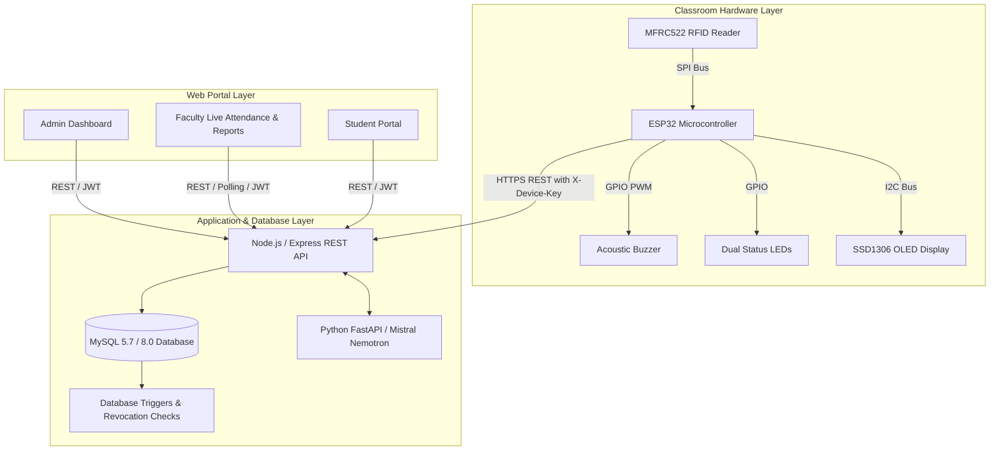

# TapID: Smart Campus RFID Attendance System
## Comprehensive User & Operations Manual
**Document Version:** 1.0 (Production Release)  
**System Status:** Operational & Production-Verified  
**Repository:** [dooti2325/TapID](file:///d:/TapID)

---

## Table of Contents
1. [System Architecture & Overview](#1-system-architecture--overview)
2. [Hardware Terminal & Wiring Schematic](#2-hardware-terminal--wiring-schematic)
3. [Installation & Quick-Start Setup](#3-installation--quick-start-setup)
4. [User Roles & Default Credentials](#4-user-roles--default-credentials)
5. [User Workflows & Operational Guides](#5-user-workflows--operational-guides)
   - [5.1 Administrator Guide](#51-administrator-guide)
   - [5.2 Faculty / Instructor Guide](#52-faculty--instructor-guide)
   - [5.3 Student Portal Guide](#53-student-portal-guide)
   - [5.4 Hardware Terminal Operation](#54-hardware-terminal-operation)
   - [5.5 AI Attendance Copilot (Mistral Nemotron)](#55-ai-attendance-copilot)
6. [Database Management & Automated Backups](#6-database-management--automated-backups)
7. [Over-The-Air (OTA) Firmware Fleet Updates](#7-over-the-air-ota-firmware-fleet-updates)
8. [Production Deployment & Containerization](#8-production-deployment--containerization)
9. [Troubleshooting & Diagnostic Runbook](#9-troubleshooting--diagnostic-runbook)

---

## 1. System Architecture & Overview

TapID is an enterprise-grade IoT and web platform engineered for real-time, tamper-proof student attendance tracking across collegiate campuses. It unifies physical RFID hardware terminals, an Express REST API, a single-page React management portal, a high-performance relational database with automated security triggers, and an AI analytics copilot.



### Key Technical Capabilities:
- **Instant Attendance Verification:** Card taps are recorded in < 250ms via persistent SPI communication.
- **Fail-Safe Offline Mode:** If campus Wi-Fi drops, the ESP32 buffers up to 50 card taps in an onboard FIFO ring buffer, automatically performing a batched sync once Wi-Fi reconnects.
- **Strict Revocation Enforcement:** Stolen or lost cards are denied at both the database trigger level and the application layer with HTTP 403 Forbidden.
- **Real-Time Live Lecture Monitoring:** Instructors can project or view a live attendance roster that dynamically marks students present as they tap in at the door.
- **Export Engine:** Client-side vector PDF generation with university branding and instant CSV spreadsheet download.
- **AI Analytics:** Integrated with NVIDIA NIM (`mistralai/mistral-nemotron`) for attendance anomaly detection and predictive defaulter warnings.

---

## 2. Hardware Terminal & Wiring Schematic

Each classroom terminal consists of an ESP32 microcontroller, an MFRC522 13.56 MHz RFID reader, status LEDs, and an acoustic buzzer.

### Wiring & Pinout Table

| ESP32 Pin | Component | Component Pin | Function / Protocol | Notes |
| :--- | :--- | :--- | :--- | :--- |
| **3V3** | RC522 | VCC | 3.3V Power | **Do NOT connect to 5V!** |
| **GND** | RC522, LEDs, Buzzer | GND | Ground | Common Ground |
| **GPIO 21** | RC522 | SDA / SS | SPI Slave Select | Configurable in `config.h` |
| **GPIO 18** | RC522 | SCK | SPI Clock | Hardware SPI Clock |
| **GPIO 23** | RC522 | MOSI | SPI Master Out Slave In | Hardware SPI Data |
| **GPIO 19** | RC522 | MISO | SPI Master In Slave Out | Hardware SPI Data |
| **GPIO 22** | RC522 | RST | Hardware Reset | Reader Reset Line |
| **GPIO 25** | Buzzer | Positive (+) | Acoustic Feedback | Active or Passive Buzzer |
| **GPIO 26** | Green LED | Anode (+) via 220Ω | Status: Success / Online | Visual Pass Indicator |
| **GPIO 27** | Red LED | Anode (+) via 220Ω | Status: Denied / Error | Visual Warning Indicator |

### Audio-Visual Feedback Signaling Matrix

| System State | Green LED | Red LED | Buzzer Tone | Display Message |
| :--- | :--- | :--- | :--- | :--- |
| **Terminal Ready / Idle** | Solid ON | OFF | Silent | "Tap ID Card to Scan" |
| **Successful Attendance Tap** | 1 Quick Blink | OFF | 1 Short Beep (2000 Hz, 150ms) | "Welcome, [Student Name]" |
| **Card Already Tapped (Debounce)** | OFF | 2 Rapid Blinks | 2 Rapid Clicks (1000 Hz, 80ms) | "Already Recorded" |
| **Revoked / Unauthorized Card** | OFF | 3 Long Blinks | 3 Long Low Beeps (400 Hz, 400ms) | "ACCESS DENIED / REVOKED" |
| **Offline Mode Active (No Wi-Fi)** | OFF | Slow Breathing | Silent | "Offline (Queued #)" |
| **Bulk Queue Syncing** | Rapid Strobe | Rapid Strobe | 1 Confirmation Chime | "Syncing Offline Records..." |

---

## 3. Installation & Quick-Start Setup

### Prerequisites
- **Node.js**: v18.0.0 or higher (v20+ recommended)
- **MySQL**: 5.7 or 8.0 running locally or via Docker
- **Python**: 3.10+ (for AI Copilot service)
- **Compiler**: GCC / G++ (for firmware tests) or Arduino IDE 2.x (for flashing hardware)

### 1. Clone & Configure Environment
```bash
git clone https://github.com/dooti2325/TapID.git
cd TapID
```

Copy the example environment template and configure secrets:
```bash
cp .env.example .env
```

Verify your `.env` contains the required keys:
```ini
PORT=3000
DB_HOST=localhost
DB_PORT=3307
DB_USER=tapid_user
DB_PASS=tapid_password
DB_NAME=tapid
JWT_SECRET=tapid-super-secure-jwt-secret-key-2026
DEVICE_API_KEY=tapid-esp32-device-key-2026
NVIDIA_API_KEY=nvapi-your-key-here
```

### 2. Initialize the Database
Run the automated schema, triggers, and seed script:
```bash
node backend/init_local_db.js
```
*This establishes all 11 tables, 14 foreign keys, audit triggers, and test credentials.*

### 3. Install Dependencies & Build
Install all root, backend, and frontend packages:
```bash
npm install
npm run build
```

### 4. Running the Development Servers
Open separate terminals or run concurrently:
```bash
# Terminal 1: Backend API Gateway
npm run dev:backend

# Terminal 2: Frontend Web Client (Vite Dev Server)
npm run dev:frontend

# Terminal 3: AI Copilot Service (Optional)
cd ai
source .venv/bin/activate  # or .\.venv\Scripts\Activate.ps1
uvicorn main:app --port 8000 --reload
```

---

## 4. User Roles & Default Credentials

TapID features strict Role-Based Access Control (RBAC). The seed database comes with the following pre-configured user accounts:

| Role | Email Address | Password | Permissions & Scope |
| :--- | :--- | :--- | :--- |
| **Administrator** | `admin@tapid.edu` | `password123` | Full system access: device provisioning, card assignment, revocation, classroom/subject configuration, and audit logs. |
| **Faculty / Teacher** | `faculty@tapid.edu` | `password123` | Start/end attendance sessions, live lecture monitor, manual attendance overrides, view rosters, generate PDF/CSV reports. |
| **Student** | `harshal.vidhate@tapid.edu` | `password123` | View personal attendance percentage, course breakdown, and attendance warnings. |

---

## 5. User Workflows & Operational Guides

### 5.1 Administrator Guide

#### A. Managing RFID Cards
1. Log in as an Administrator (`admin@tapid.edu`).
2. Navigate to **Admin -> RFID Cards** in the sidebar.
3. **Card Assignment:**
   - Click the **"Assign Card"** button.
   - Enter the Card UID (e.g. `14:F2:3C:99` or hexadecimal string).
   - Select the target student from the dropdown roster.
   - Click **Save**. The card is now immediately active across all campus terminals.
4. **Card Revocation (Immediate Security Action):**
   - Locate the student or card in the table.
   - Click **"Revoke"** or toggle status to `Revoked`.
   - The card is instantly invalidated in the database. Any subsequent tap on any terminal will trigger an acoustic alarm and an HTTP 403 rejection.

#### B. Fleet Device Monitoring
1. Navigate to **Admin -> Devices**.
2. View terminal connection status (`online`, `offline`), current MAC addresses, and assigned lecture halls.
3. Click on a device to configure ping intervals or reassign it to a different physical classroom.

#### C. System Audit Logs
1. Navigate to **Admin -> Audit Logs**.
2. Inspect immutable logs recorded for every administrative action, card status change, and session lifecycle event with precise timestamps and user IDs.

---

### 5.2 Faculty / Instructor Guide

#### A. Starting an Attendance Session
1. Log in with your faculty account (`faculty@tapid.edu`).
2. Click **"Start Attendance"** on the dashboard.
3. Select the **Classroom** (e.g. `Room 402 - Engineering Block A`).
4. Select the **Subject** (e.g. `CS-301 Computer System Security`).
5. Select the **Student Section** (e.g. `Batch G1`).
6. Click **"Start Live Session"**. The terminal assigned to that room will automatically activate.

#### B. Monitoring Real-Time Attendance
1. The screen will automatically navigate to **Live Attendance**.
2. As students tap their RFID cards at the classroom door terminal:
   - Their name, roll number, and exact timestamp appear instantly on the live roster.
   - The present counter and attendance percentage dynamically recalculate.
   - A visual pulse highlights the most recent arrival.
3. **Manual Override:** If a student forgot their card, the instructor can manually search their name and click **"Mark Present"** to grant manual credit.

#### C. Ending the Lecture & Generating Reports
1. When the lecture finishes, click the red **"End Session"** button.
2. Navigate to **Reports** in the navigation bar.
3. Filter by Subject, Date Range, or Section.
4. Click **"Export PDF"** to generate an official print-ready attendance sheet with institutional header, summary counts, and defaulter highlights.
5. Click **"Export CSV"** to download raw data for import into college ERP or LMS systems.

---

### 5.3 Student Portal Guide

1. Log in with student credentials.
2. The student dashboard displays:
   - **Overall Attendance Percentage:** Highlighted in Green (> 75%), Amber (65%–75%), or Red (< 65% - Defaulter Warning).
   - **Course-by-Course Breakdown:** Total lectures held vs. lectures attended.
   - **Recent Tap History:** Date, time, classroom, and recorded status for every scan.

---

### 5.4 Hardware Terminal Operation

1. **Boot Up:** Power the terminal via 5V micro-USB or terminal power rail.
2. The device connects to the campus Wi-Fi specified in `secrets.h`.
3. Once connected, the green LED lights up and the display reads `TapID Ready`.
4. **Normal Scan:** Student taps their card within 3cm of the RC522 faceplate:
   - Single beep sounds.
   - Green LED blinks once.
   - Screen displays student name and present status.
5. **Offline Operation:** If campus internet fails:
   - Terminal enters offline buffering mode.
   - Valid taps continue to be accepted and stored in the 50-item EEPROM ring buffer.
   - Once network is restored, the terminal flushes all buffered records in a single bulk request (`/api/attendance/bulk-record`).

---

### 5.5 AI Attendance Copilot

Powered by `mistralai/mistral-nemotron`, the AI service analyzes historical attendance patterns to surface actionable insights.

- **Defaulter Prediction:** Identifies students mathematically on track to fall below the mandatory 75% attendance threshold before end-of-semester.
- **Natural Language Queries:** Instructors can prompt:
  > *"Who has missed more than 3 consecutive lectures in Computer Networks?"*  
  > *"Generate an attendance summary for Section G1 this week."*
- The AI service cross-references attendance records without exposing sensitive credentials or PII.

---

## 6. Database Management & Automated Backups

TapID includes built-in scripts for zero-downtime backups, Gzip compression, and rolling retention.

### Running a Manual Backup
```bash
npm run db:backup
```
- Output: `backups/tapid_backup_YYYY-MM-DDTHH-mm-ss-msZ.sql.gz`
- Automatically retains the last **14 rolling backups** and prunes older archives.

### Restoring from a Backup
```bash
# Restore latest backup automatically
npm run db:restore

# Or restore a specific archive:
node scripts/restore_database.js backups/tapid_backup_2026-10-01T07-27-50-270Z.sql.gz
```

### Automated Daily Cron Job (Linux / Production Host)
To automate daily backups at 02:00 AM, add this entry to `crontab -e`:
```bash
0 2 * * * cd /opt/tapid && /usr/bin/node scripts/backup_database.js >> /var/log/tapid_backup.log 2>&1
```

---

## 7. Over-The-Air (OTA) Firmware Fleet Updates

TapID terminals include an embedded `ArduinoOTA` listener. You can flash new firmware over the network without visiting classrooms in person.

### Flashing via Arduino CLI
```bash
arduino-cli compile --fqbn esp32:esp32:esp32 firmware/esp32/tapid_reader
arduino-cli upload -p 192.168.1.150 --fqbn esp32:esp32:esp32 firmware/esp32/tapid_reader
```

### Flashing via Arduino IDE
1. Open `firmware/esp32/tapid_reader/tapid_reader.ino`.
2. Under **Tools -> Port**, select the network port corresponding to `tapid-reader (192.168.x.x)`.
3. Enter the OTA security password defined in `config.h`.
4. Click **Upload**.

---

## 8. Production Deployment & Containerization

### Option A: Unified Static Production Mode (Single Node Instance)
The Express backend is pre-configured to build and serve the production React SPA directly:
```bash
# 1. Build frontend bundle
npm run build

# 2. Start unified server in production mode
NODE_ENV=production npm start
```
*The web portal and the API are served on a single port (default 3000), eliminating CORS overhead.*

### Option B: Docker Compose
```bash
docker-compose -f docker-compose.yml up -d --build
```
This launches:
- `tapid-mysql`: Pre-configured database container on internal network.
- `tapid-backend`: Node.js API with health checks.
- `tapid-frontend`: Optimized Nginx container serving static frontend assets.

---

## 9. Troubleshooting & Diagnostic Runbook

### Issue 1: Database Connection Error (`ECONNREFUSED`)
- **Symptom:** Backend logs show `connect ECONNREFUSED 127.0.0.1:3307`.
- **Cause:** MySQL service is stopped or port mismatch.
- **Resolution:**
  1. Verify MySQL is running:
     ```powershell
     Get-Service -Name MySQL*
     ```
  2. Confirm `DB_PORT` in `.env` matches the active MySQL server port (e.g. 3306 or 3307).

### Issue 2: Terminal Reports "HTTP 401 Unauthorized"
- **Symptom:** Terminal serial monitor displays `[HTTP] Request failed: 401`.
- **Cause:** Device API key mismatch between ESP32 firmware and backend `.env`.
- **Resolution:**
  - Verify that `DEVICE_API_KEY` in `.env` exactly matches `DEVICE_API_KEY` in `firmware/esp32/secrets.h`.

### Issue 3: Card Scan Returns "HTTP 403 Forbidden"
- **Symptom:** Red LED blinks 3 times with low acoustic warning.
- **Cause:** The scanned card has been revoked or lost.
- **Resolution:** Check the card status in **Admin -> RFID Cards**. If the card was re-issued, update its status back to `active`.

### Issue 4: Wi-Fi Connection Timeout on ESP32
- **Symptom:** Yellow/Red LED continuous breathing; terminal prints `[WiFi] Connection timed out`.
- **Cause:** Incorrect Wi-Fi credentials or 5 GHz network used.
- **Resolution:**
  - Ensure the ESP32 is connecting to a **2.4 GHz Wi-Fi band** (ESP32 hardware does not support 5 GHz).
  - Verify `WIFI_SSID` and `WIFI_PASSWORD` in `secrets.h`.

---

## 10. Verification Test Commands Reference

To verify that all components are functioning before production deployment:

```bash
# 1. Run all Backend Unit Tests (55/55 tests)
npm --prefix backend test

# 2. Run all Frontend Vitest Suites (17/17 tests)
npm --prefix frontend test -- --run

# 3. Compile & Run C++ Firmware Offline Queue Tests (5/5 tests)
npm run test:firmware

# 4. Test Unified Production Deployment & SPA Deep Links
node backend/test_production_deploy.js

# 5. Run Live End-to-End Integration Suite (12/12 scenarios)
node backend/test_e2e_live.js
```

---
*TapID Engineering Team © 2026. All rights reserved.*
